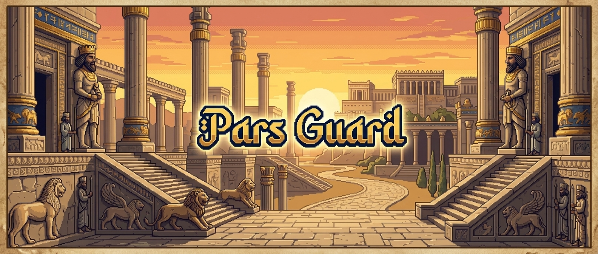
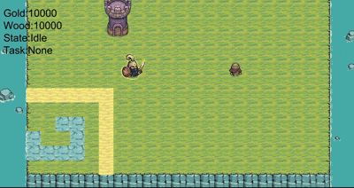
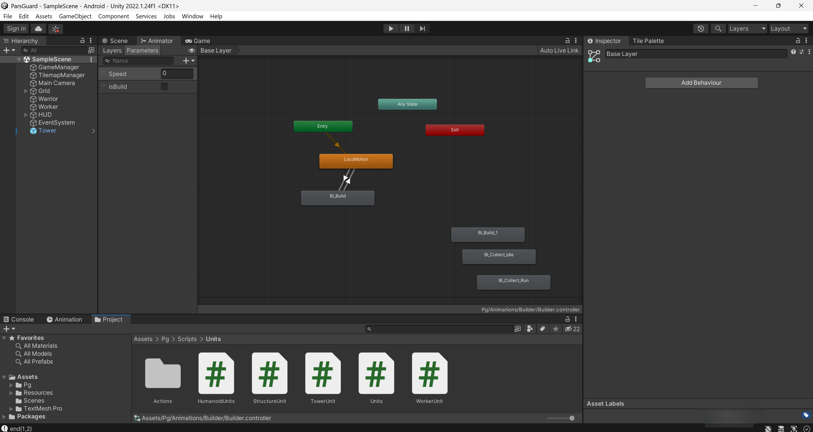
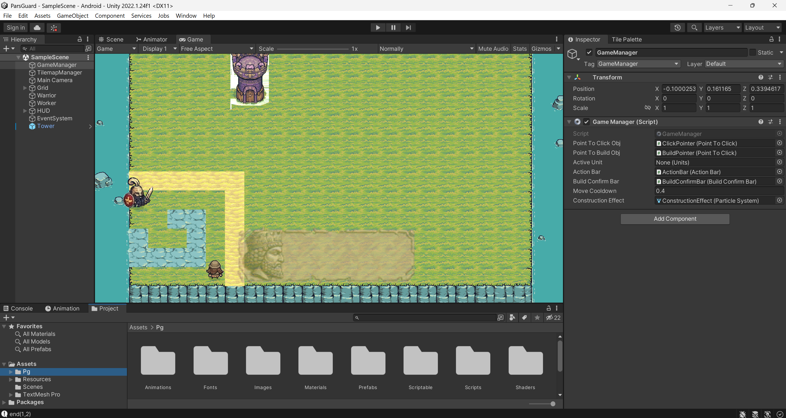

# Pars Guard (Prototype)

> A small Unity RTS-style prototype featuring unit selection, click-to-move, building placement, construction workflow, basic UI, and an early pathfinding foundation.




---

## Overview

This project is a lightweight **real-time strategy prototype** built in Unity. The core gameplay loop includes:

- selecting units
- clicking on the ground to move
- showing contextual action buttons
- starting a building placement process
- confirming resource costs before construction
- assigning a worker to construct a structure
- updating build progress until completion

The codebase is organized around a few central systems:

- **Game flow and input management**
- **Tile and placement validation**
- **Units and structures**
- **Construction runtime process**
- **Action/UI bars**
- **Utility helpers for click/touch input**

---

## Demo

### Gameplay GIF




## Features

- Unit selection system
- Click-to-move interaction
- Action bar with dynamic buttons
- Building placement preview flow
- Build confirmation UI with resource requirements
- Worker-based construction logic
- Tilemap validation for walking and placement
- Singleton-style managers for central systems
- Early pathfinding/grid infrastructure
- Visual click/build feedback effects

---

## Project Architecture

```text
Input / Click Handling
    PgUtils
       ↓
GameManager
 ├─ Unit Selection
 ├─ Move Commands
 ├─ Action Bar Control
 ├─ Build Placement Flow
 └─ Resource Validation
       ↓
PlacementPrc → BuildConfirmBar → BuildingProc
                               ↓
                    StructureUnit / WorkerUnit

Tile Validation
    TilemapManager
       ↓
    PathFinding / Grid / Nodes
```

---

## Core Systems

### 1) GameManager

`GameManager` is the main coordinator of gameplay.

Responsibilities include:

- handling click/touch input
- selecting and deselecting units
- detecting whether the player clicked on ground or a unit
- showing the correct UI actions for the selected unit
- starting the build placement process
- confirming or cancelling construction
- tracking and spending resources like **Gold** and **Wood**
- spawning click/build visual feedback

This is effectively the central gameplay controller.

---

### 2) Units System

The project appears to use a shared base class:

- `Units` → common base type

Derived or related types include:

- `HumanoidUnits`
- `WorkerUnit`
- `StructureUnit`
- `TowerUnit`
- `AIPawn`

#### Notes

- `HumanoidUnits` seems to act as a marker/category for controllable humanoid entities.
- `WorkerUnit` is involved in the construction flow.
- `StructureUnit` represents buildings and keeps track of whether construction is still in progress.
- `TowerUnit` appears to be a specialized structure.
- `AIPawn` implements simple movement toward a destination.

---

### 3) Building / Construction Flow

The construction pipeline appears to be:

1. Player selects a valid unit
2. `GameManager` starts build mode using a `BuildActionsSO`
3. `PlacementPrc` shows placement preview
4. The game validates whether placement is allowed
5. `BuildConfirmBar` displays resource cost
6. Resources are checked and reduced
7. `BuildingProc` begins runtime construction
8. A `WorkerUnit` is assigned
9. `StructureUnit` completes construction after enough progress/time

This is one of the strongest and clearest systems in the current codebase.

---

### 4) Tilemap and Placement Validation

`TilemapManager` validates the world for:

- walkable tiles
- blocked tiles
- unreachable tiles
- valid build placement areas
- overlay tile updates for placement/path feedback

This manager works closely with pathfinding and construction placement.

---

### 5) Pathfinding Foundation

The pathfinding-related files are:

- `PathFinding.cs`
- `Node.cs`

Current status based on the available code summary:

- a grid is initialized
- nodes store coordinate and walkability data
- start and end nodes can be detected
- full path search does **not appear fully implemented yet**

So this is currently more like a foundation for a future complete pathfinding system (A*) than a finished navigation module.

---

### 6) UI Systems

#### ActionBar

The `ActionBar` dynamically registers and clears action buttons.

Related files:

- `ActionBar.cs`
- `ActionButton.cs`

Typical use case:

- select a unit
- populate the action bar with available commands
- click an action button to execute gameplay logic

#### BuildConfirmBar

The build confirmation UI includes:

- required resource display
- confirm button
- cancel button

Related files:

- `BuildConfirmBar.cs`
- `ResourceReqUI.cs`

---

### 7) Input Utilities

`PgUtils.cs` abstracts click/touch handling such as:

- reading input position
- detecting click begin/end
- hold position
- ignoring interaction when pointer is over UI

This helps keep `GameManager` cleaner.

---

## File-by-File Summary

### `AIPawn.cs`
Basic AI pawn movement toward a destination point.

### `Node.cs`
Represents a grid node for pathfinding and walkability checks.

### `PathFinding.cs`
Initial grid/pathfinding system. Appears incomplete for full path solving.

### `GameManager.cs`
Main gameplay manager handling input, selection, movement, build flow, UI, and resources.

### `SinglatonManager.cs`
Generic singleton-style base manager.

### `TilemapManager.cs`
Checks walkability, placement validity, blocked areas, and tile overlays.

### `ActionBar.cs`
Container for gameplay action buttons.

### `ActionButton.cs`
Single action button entry in the action bar.

### `BuildConfirmBar.cs`
Construction confirmation panel with confirm/cancel controls.

### `PointToClick.cs`
Visual effect/feedback for clicks or placement interactions.

### `ResourceReqUI.cs`
Displays gold/wood requirements and affordability.

### `ActionsSO.cs`
Action-related ScriptableObject definition.

### `BuildActionsSO.cs`
Construction-specific action data such as prefab, sprites, time, and costs.

### `HumanoidUnits.cs`
Marker or specialized unit category for humanoid units.

### `StructureUnit.cs`
Building/structure unit with under-construction state management.

### `TowerUnit.cs`
Specialized structure type.

### `Units.cs`
Shared base class for gameplay units.

### `WorkerUnit.cs`
Worker entity used for construction-related actions.

### `BuildingProc.cs`
Runtime controller for construction progress, worker assignment, and completion.

### `PgUtils.cs`
Static utility class for click/touch input handling.

### `PlacementPrc.cs`
Handles placement preview and placement confirmation flow.

---

## Project structure

This is just scripts:

```text
Scripts
   ├── Managers/
   │   ├── GameManager.cs
   │   ├── SinglatonManager.cs
   │   └── PgUtils.cs
   ├── Units/
   │   ├── Units.cs
   │   ├── HumanoidUnits.cs
   │   ├── WorkerUnit.cs
   │   ├── StructureUnit.cs
   │   ├── TowerUnit.cs
   │   └── AIPawn.cs
   ├── Building/
   │   ├── BuildingProc.cs
   │   ├── PlacementPrc.cs
   │   └── BuildActionsSO.cs
   ├── Pathfinding/
   │   ├── PathFinding.cs
   │   └── Node.cs
   ├── Tilemap/
   │   └── TilemapManager.cs
   └── UI/
       ├── ActionBar.cs
       ├── ActionButton.cs
       ├── BuildConfirmBar.cs
       └── ResourceReqUI.cs

```

---

## Scripts to Use

The intended usage likely looks like this:

1. Open the project in Unity
2. Add the required managers to the scene:
   - `GameManager`
   - `TilemapManager`
3. Set up the tilemaps and walkable/unreachable tiles
4. Assign UI references:
   - `ActionBar`
   - `BuildConfirmBar`
   - `ResourceReqUI`
5. Create units and structures in the scene/prefabs
6. Create `ScriptableObject` assets for actions/build actions
7. Enter play mode and test selection, movement, and construction

---

## Media Placeholders

Screenshots from Unity 2022.

### Screenshot 1



### Screenshot 2




